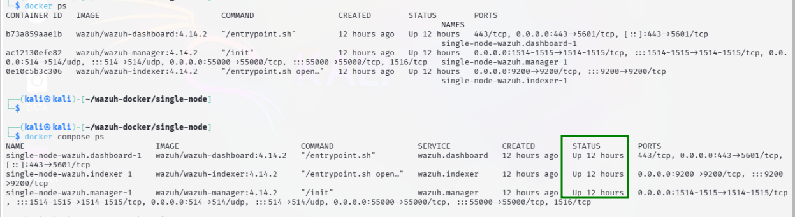
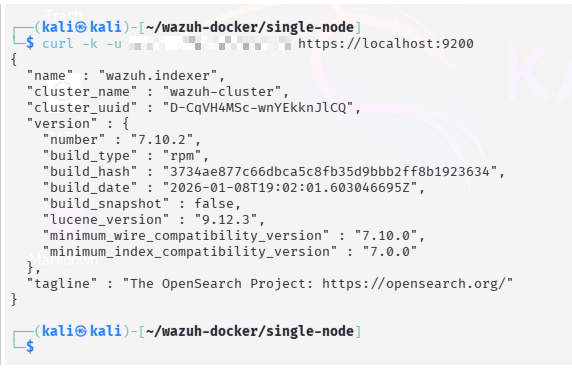
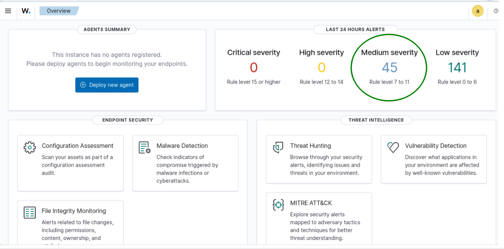

# Project Aegis-Zero: Autonomous Agentic SOC

## Phase 1: High-Efficiency SIEM Foundation

**Author:** Ghulam Muhammad  
**Status:** Phase 1 (Core Infrastructure) Complete  
**Architecture:** Containerized Microservices  
**Hardware Target:** Low-Resource Local Hardware (16GB RAM / 4-Core CPU)

---

## 1. Project Vision

Modern Security Operations Centers (SOCs) face "Alert Fatigue" and high infrastructure costs. **Aegis-Zero** is a proof-of-concept designed to prove that enterprise-grade security monitoring can be:

1. **Cost-Effective:** $0 infrastructure cost using Open Source tools.
2. **Resource-Efficient:** Custom-tuned to run on consumer-grade hardware.
3. **Autonomous:** Future phases include LangGraph AI Agents for automated triage.

## 2. Technical Achievement (Phase 1)

In this phase, I deployed a fully functional **Wazuh SIEM** stack (Indexer, Manager, and Dashboard) using Docker.

### Key Engineering Challenges Overcome

* **Memory Optimization:** Successfully tuned the Wazuh Indexer (Java-based OpenSearch) from the standard 4GB allocation down to **1.5GB (Xms1500m/Xmx1500m)**. This ensures stability on a 16GB host while leaving overhead for upcoming AI modules.
* **Security Hardening:** Implemented full TLS/SSL certificate-based communication between all microservices using a custom Certificate Authority (CA).
* **Docker Orchestration:** Utilized Docker Compose with hard resource limits (`deploy: resources: limits`) to prevent system-wide crashes during log spikes.
* **Kernel Tuning:** Optimized Linux host kernel parameters (`vm.max_map_count`) to support high-performance indexing.

## 3. The Stack

| Service | Role | Memory Limit | Status |
| :--- | :--- | :--- | :--- |
| **Wazuh Indexer** | Log Storage & Search | 2.0 GB | Healthy |
| **Wazuh Manager** | Analysis & Rule Engine | 2.0 GB | Healthy |
| **Wazuh Dashboard**| UI & Visualization | 2.0 GB | Healthy |

## 4. How to Verify

```bash
# Verify all services are running
docker compose ps

# Verify Indexer Authentication
curl -k -u admin:<YOUR_PASSWORD> https://localhost:9200
```

## 5. Next Milestones

* [ ] **Phase 2:** Integrate Suricata for Network Intrusion Detection (NIDS).
* [ ] **Phase 3:** Deploy ML-based anomaly detection for "Slow and Low" network scans.
* [ ] **Phase 4:** Integrate LangGraph AI Agent for autonomous alert investigation.

## 6. Proof of Deployment (Phase 1)

### A. Container Health (Docker)

All microservices are running in a health state with strict memory limits.


### B. Indexer API Verification

Secure communication with the Wazuh Indexer verified via authenticated CLI.


### C. Live Security Dashboard

The Web UI is fully operational, showing active event monitoring.

