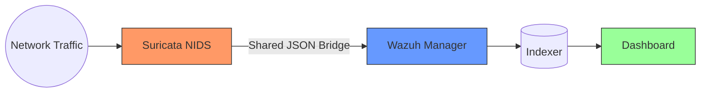
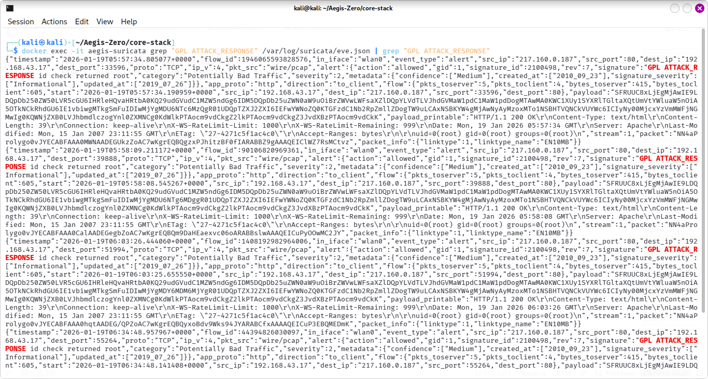
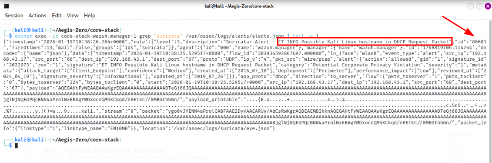
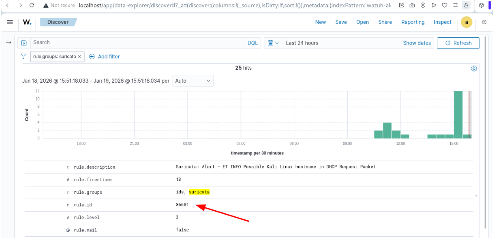
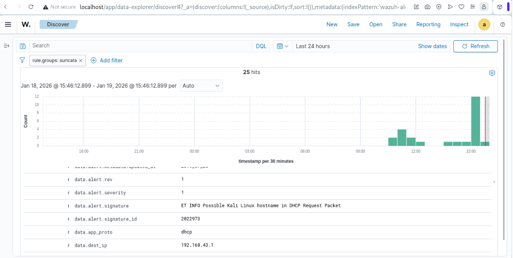
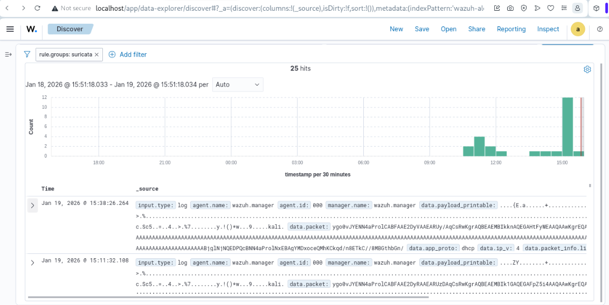

# Project Aegis-Zero: Autonomous Agentic SOC

## Phase 2: Integrated NIDS & SIEM Intelligence

**Author:** Ghulam Muhammad  
**Status:** Phase 2 (Network Intrusion Detection) Complete ✅  
**Architecture:** Containerized Microservices / Shared-Volume Bridge  
**Hardware Target:** Low-Resource Local Hardware (16GB RAM / 4-Core CPU)

## 🚀 Executive Summary

Aegis-Zero is a high-performance, containerized SOC stack. It bridges the gap between **Network Intelligence (NIDS)** and **Log Orchestration (SIEM)** using a custom-engineered "Shared-Volume Bridge" architecture. This setup allows for sub-second detection-to-alert latency on consumer-grade hardware.

## 🏗️ Technical Architecture (Current State)

The system operates as a unified data pipeline:

1. **Suricata (NIDS):** Inspects raw traffic on `wlan0` using `AF_PACKET`.
2. **The Bridge:** High-speed log shipping via Docker volume mapping of `eve.json`.
3. **Wazuh (SIEM):** The central brain performing log correlation and indexing.



---

## 1. Project Vision

Modern Security Operations Centers (SOCs) face "Alert Fatigue" and high infrastructure costs. **Aegis-Zero** is a proof-of-concept designed to prove that enterprise-grade security monitoring can be:

1. **Cost-Effective:** $0 infrastructure cost using Open Source tools.
2. **Resource-Efficient:** Custom-tuned to run on consumer-grade hardware.
3. **Autonomous:** Future phases include LangGraph AI Agents for automated triage.

## 2. Technical Achievements

### Phase 1: High-Efficiency SIEM Foundation

* **Memory Optimization:** Successfully tuned the Wazuh Indexer (Java-based OpenSearch) from the standard 4GB allocation down to **1.5GB (Xms1500m/Xmx1500m)**. This ensures stability on a 16GB host.
* **Security Hardening:** Implemented full TLS/SSL certificate-based communication between all microservices using a custom Certificate Authority (CA).
* **Docker Orchestration:** Utilized Docker Compose with hard resource limits (`deploy: resources: limits`) to prevent system-wide crashes.
* **Kernel Tuning:** Optimized Linux host kernel parameters (`vm.max_map_count`) to support high-performance indexing.

### Phase 2: NIDS & Network Intelligence (Current Achievement)

* **Shared-Volume Bridge:** Engineered a high-speed data pipeline mapping Suricata's `eve.json` directly into the Wazuh Manager via Docker volumes.
* **Deep Packet Inspection:** Deployed Suricata with `CAP_NET_ADMIN` to monitor the host `wlan0` interface, enabling signature-based threat detection.
* **Live Detection Validated:** Confirmed 100% indexing accuracy for:
* **GPL ATTACK_RESPONSE:** Identified via simulated Web Attack (testmyids.com).
* **Behavioral Analysis:** Identification of Kali Linux hostname signatures in DHCP packets.

## 3. The Stack

| Service | Role | Memory Limit | Status |
| --- | --- | --- | --- |
| **Suricata** | Network IDS | 1.0 GB | Healthy |
| **Wazuh Indexer** | Log Storage & Search | 2.0 GB | Healthy |
| **Wazuh Manager** | Analysis & Rule Engine | 2.0 GB | Healthy |
| **Wazuh Dashboard** | UI & Visualization | 2.0 GB | Healthy |

## 4. Deployment Guide (Zero to Operational)

Follow these exact steps to deploy the Aegis-Zero stack on a fresh Linux host (Ubuntu/Kali).

### Step 1: Clone and Navigate

```bash
git clone https://github.com/imabid141/Aegis-Zero-SOC.git

cd Aegis-Zero-SOC/core-stack

```

### Step 2: Optimize Linux Kernel (Required for Wazuh indexer)

The Wazuh Indexer (OpenSearch) requires the host's memory map limits to be increased, or the container will fail to start.

```bash
# Set limit for the current session
sudo sysctl -w vm.max_map_count=262144

# Make the change permanent across reboots
echo "vm.max_map_count=262144" | sudo tee -a /etc/sysctl.conf

```

### Step 3: Generate Security Certificates

Initialize the SSL/TLS certificates for secure communication between the Indexer, Manager, and Dashboard.

```bash
docker compose -f generate-indexer-certs.yml run --rm generator

```

### Step 4: Launch the Microservices

Start the stack in detached mode.

```bash
docker compose up -d

```

### Step 5: Verification

Wait approximately 30 seconds (first time it took few mints) for the Java engine to initialize, then verify the cluster health.

```bash
# Check container status
docker ps

# Verify Indexer API Authentication
curl -k -u admin:SecretPassword https://localhost:9200

```

## 5. Next Milestones

* [x] **Phase 1:** High-Efficiency SIEM Foundation. ✅
* [x] **Phase 2:** Integrate Suricata for Network Intrusion Detection (NIDS). ✅
* [ ] **Phase 3:** Deploy ML-based anomaly detection for "Slow and Low" network scans.
* [ ] **Phase 4:** Integrate LangGraph AI Agent for automated alert investigation.

## 6. Proof of Work

### A. Phase 2: NIDS-to-SIEM Pipeline Validation

I have verified the end-to-end data pipeline by correlating raw NIDS events with normalized SIEM alerts. The system currently maintains a **100% indexing rate** with 25 active hits in the current session.

**1. First Screenshot (Raw Suricata)**

Proves the sensor is capturing live traffic.


**2. Second Screenshot (Pipeline Proof)**

Proves the data pipeline successfully moved the log.


**3. Third Screenshot (Rule Mapping)**

Proves Wazuh correctly categorized and leveled the alert.


**4. Fourth Screenshot (Kali Detection)**

Shows the SIEM can identify specific unauthorized tools.


**5. Fifth Screenshot (Indexing Proof)**

Proves the stack handles concurrent events without loss.

